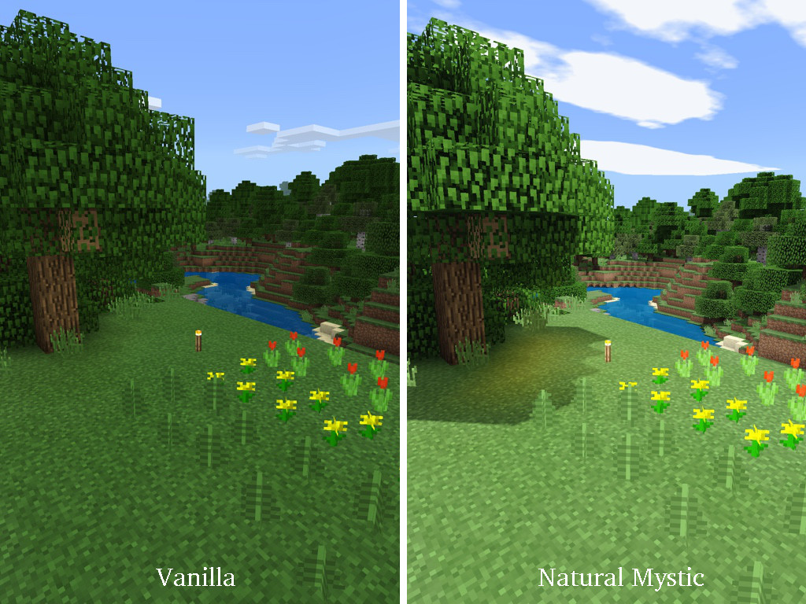
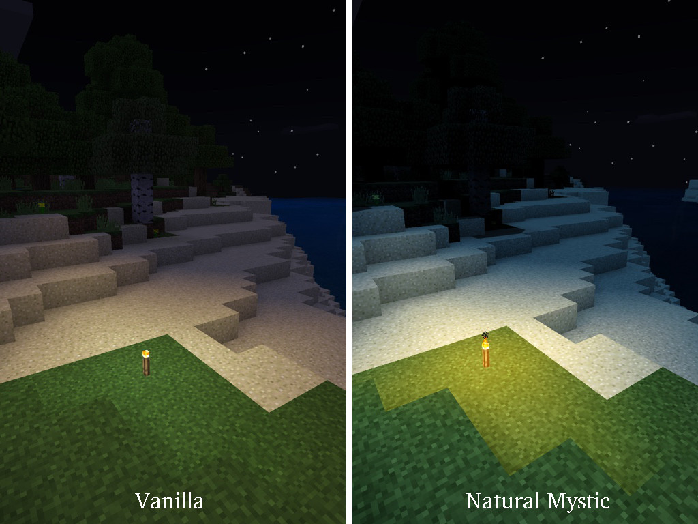

# Natural Mystic Shaders

**Natural Mystic** is a shader pack for Minecraft Bedrock aiming to be
as realistic as possible.

Features include:

* Shadow
* Improved torch light with flickering effect
* Sunlight and moonlight colors with night time desaturation
* Exposure adjustment, contrast filter, and tone mapping

## Supported platforms

* iOS
* Android (untested)

## Tested on

* Minecraft Bedrock 1.8, iPad Pro (MLMY2J/A), iOS 12.1 (16B92)

## Author

PHO

## License
[CC0](https://creativecommons.org/share-your-work/public-domain/cc0/)
“No Rights Reserved”
